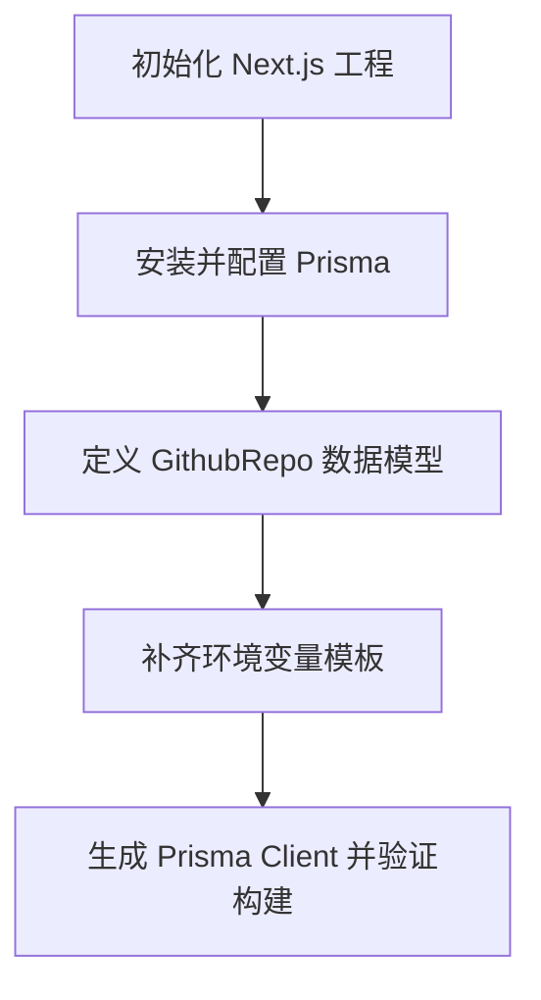

## 1. 产品概述
GitHub Repo AI Catalog MVP 用于接收公开 GitHub 仓库地址，自动抓取仓库信息并通过 AI 生成中文总结、分类与标签，再保存为可浏览的目录数据。
- 当前阶段聚焦 Task1，先建立 Next.js + Tailwind + TypeScript + ESLint + pnpm 基础工程，以及 Prisma 数据层与环境变量模板
- 目标是为后续仓库分析 API、列表页和详情页提供稳定、可扩展的项目骨架

## 2. 核心功能
### 2.1 功能模块
1. **项目基础初始化**：创建 Next.js App Router 工程，启用 Tailwind、TypeScript、ESLint 与 pnpm
2. **数据库基础配置**：接入 Prisma，配置 PostgreSQL 数据源与 Prisma Client 生成流程
3. **仓库数据模型**：定义 `GithubRepo` 数据模型，覆盖仓库基础信息与 AI 分析结果存储字段
4. **环境变量模板**：补齐数据库、GitHub API 与 OpenAI 兼容接口所需环境变量示例

### 2.2 页面细节
| 页面名称 | 模块名称 | 功能说明 |
|----------|----------|----------|
| 首页 | 占位首页 | 验证 Next.js App Router 已正确启动，为后续接入仓库分析表单预留入口 |

## 3. 核心流程
开发者初始化项目后，配置环境变量，执行 Prisma Client 生成，再在后续任务中基于统一数据模型实现仓库分析与查询功能。

## 4. 用户界面设计
### 4.1 设计风格
- 主色为黑白中性色，保留 Tailwind 默认设计体系，优先保证后续迭代效率
- 按钮与输入框采用圆角、轻阴影与清晰聚焦态
- 字体使用 Next.js 默认无衬线方案，保持稳定和跨平台一致性
- 页面布局采用简洁的居中单栏结构，为后续首页输入表单和列表页面留白

### 4.2 页面设计概览
| 页面名称 | 模块名称 | UI 元素 |
|----------|----------|----------|
| 首页 | Hero 占位区 | 标题、说明文案、后续功能预告 |

### 4.3 响应式
采用桌面优先，同时保证移动端基础可读性与布局适配。
