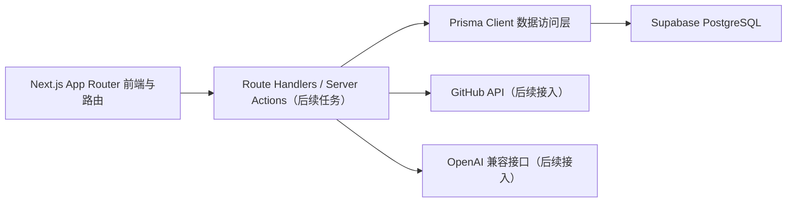
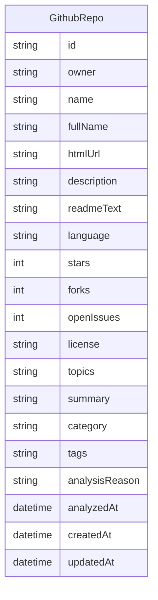

## 1. 架构设计

## 2. 技术说明
- 前端框架：Next.js 16（App Router） + React 19
- 样式方案：Tailwind CSS 4
- 语言：TypeScript 5
- 代码质量：ESLint 9
- 包管理器：pnpm
- ORM：Prisma 6
- 数据库：PostgreSQL（兼容 Supabase PostgreSQL）

## 3. 路由定义
| 路由 | 用途 |
|------|------|
| `/` | 初始化后的占位首页，后续承载仓库分析入口 |

## 4. API 定义
当前 Task1 不实现业务 API，仅完成后续 API 所需的底层依赖与数据模型准备。

## 5. 数据模型
### 5.1 数据模型定义

### 5.2 数据定义语言
- 使用 Prisma Schema 管理数据模型
- `fullName` 作为唯一键，避免重复保存同一仓库
- `topics` 与 `tags` 在 Prisma 中以 `String[]` 存储，适配 PostgreSQL 数组能力
- `description`、`readmeText`、`license` 允许为空，以兼容公开仓库字段缺失场景

## 6. 工程约定
- 业务共享工具放在 `src/lib`
- Prisma Client 单例封装放在 `src/lib/prisma.ts`
- 环境变量通过 `.env.local` 注入，本仓库提供 `.env.example` 作为模板
- 数据库连接使用 `DATABASE_URL`，Prisma 生成客户端输出到默认位置
